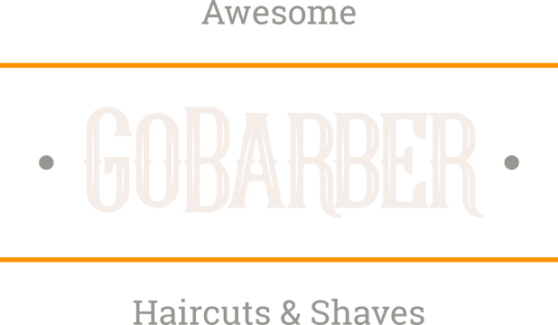

<div align="center" id="top">
  

  &#xa0;

  <!-- <a href="https://mobile.netlify.app">Demo</a> -->
</div>

<h1 align="center">GoBarber Mobile</h1>

<p align="center">
  

  

  

  <!--  -->

  <!--  -->

  <!--  -->
</p>


<h4 align="center">
	🚧  Mobile 🚀 Em construção...  🚧
</h4>

<hr>

<p align="center">
  <a href="#dart-about">About</a> &#xa0; | &#xa0;
  <a href="#sparkles-features">Features</a> &#xa0; | &#xa0;
  <a href="#rocket-technologies">Technologies</a> &#xa0; | &#xa0;
  <a href="#white_check_mark-requirements">Requirements</a> &#xa0; | &#xa0;
  <a href="#checkered_flag-starting">Starting</a> &#xa0; | &#xa0;
  <a href="#memo-license">License</a> &#xa0; | &#xa0;
  <a href="https://github.com/fabramosdev" target="_blank">Author</a>
</p>

<br>

## :dart: About ##

Aplicativo GoBarber versão Mobile

## Tela de login ###


## Tela de Cadastro ###


## :rocket: Technologies ##

The following tools were used in this project:

- [React](https://pt-br.reactjs.org/)
- [React Native](https://reactnative.dev/)
- [TypeScript](https://www.typescriptlang.org/)

## :white_check_mark: Requirements ##

Before starting :checkered_flag:, you need to have [Git](https://git-scm.com) and [Node](https://nodejs.org/en/) installed.

## :checkered_flag: Starting ##

```bash
# Clone this project
$ git clone https://github.com/fabramosdev/gobarber-mobile

# Access
$ cd mobile

# Install dependencies
$ yarn

# Run the project Android
$ yarn android

# Run the project iOS
$ yarn ios


```

## :memo: License ##

This project is under license from MIT. For more details, see the [LICENSE](LICENSE.md) file.


Made with :heart: by <a href="https://github.com/fabramosdev" target="_blank">Fabiano Ramos</a>

&#xa0;

<a href="#top">Back to top</a>
